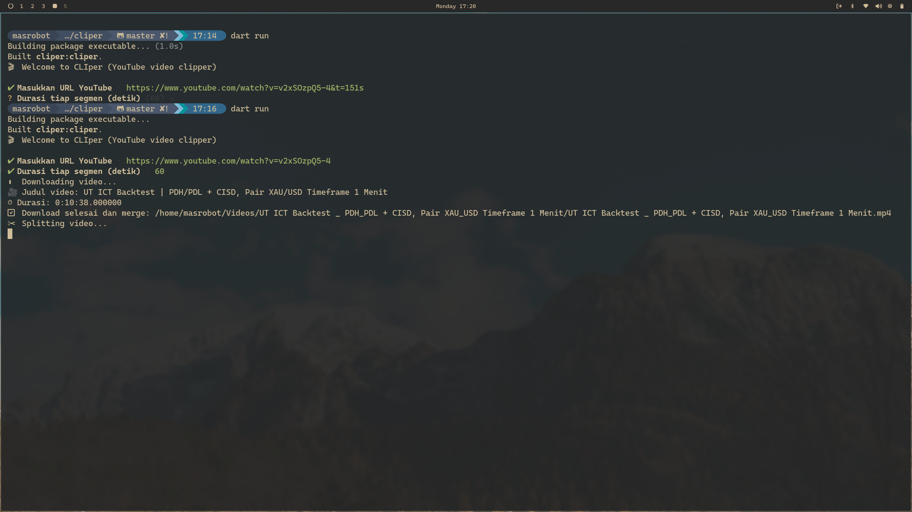

CLIper – YouTube Video Clipper (TUI)
====================================

🎬 **CLIper** adalah aplikasi berbasis terminal yang memungkinkan kamu **mengunduh video YouTube**, **memotongnya menjadi segmen pendek**, dan **mengubahnya menjadi format portrait 9:16 Full HD** secara otomatis. Cocok untuk membuat klip singkat dari video panjang untuk TikTok, Instagram Reels, atau platform lainnya.

_Contoh tampilan TUI saat download dan split video_



💡 Ide Dasar
------------

1.  Unduh video YouTube langsung dari terminal.
    
2.  Potong video menjadi segmen pendek (default 60 detik per klip).
    
3.  Crop & scale menjadi rasio portrait 9:16 (Full HD).
    
4.  Semua workflow bisa dijalankan tanpa GUI, murni CLI/TUI.
    

🛠 Tools yang Digunakan
-----------------------

*   **Dart** – bahasa pemrograman utama.
    
*   **youtube\_explode\_dart** – download video & audio YouTube.
    
*   **FFmpeg** – merge video+audio, split, crop, scale.
    
*   **interact** – membuat menu interaktif & input di terminal.
    
*   **dart\_console** (opsional) – tampilan TUI lebih rapi.
    

> ⚠️ Pastikan FFmpeg terinstall di sistem agar split & crop berjalan.

🔹 Logika Aplikasi
------------------

1.  **Input URL YouTube** – user memasukkan video target.
    
2.  **Download Video & Audio**
    
    *   Jika stream muxed ada → download langsung.
        
    *   Jika tidak → download videoOnly + audioOnly → merge via FFmpeg.
        
3.  **Split & Crop Video**
    
    *   Split video sesuai durasi segmen yang diinginkan.
        
    *   Crop & scale tiap segmen menjadi portrait 9:16 Full HD (1080x1920).
        
4.  **Output**
    
    *   File segmen muncul sebagai output000.mp4, output001.mp4, dst.
        
    *   Segmen siap diunggah ke platform social media.
        

⚡ Cara Penggunaan
-----------------

1.  Clone repo dan masuk ke folder project:

```
git clone https://github.com/MashudiSudonym/cliper-youtube-video.git
```
```
```
    

```
cd cliper-youtube-video
```
```
```

2.  Install dependency Dart:

```
```
dart pub get
```
```

3.  Pastikan FFmpeg terinstall dan tersedia di PATH:

```
```
ffmpeg -version
```
```

4.  Jalankan aplikasi:

```
```
dart run
```
```


5.  Ikuti instruksi TUI:
    
    *   Masukkan URL video YouTube
        
    *   Masukkan durasi tiap segmen (detik, default 60)
        
6.  Tunggu proses download, merge (jika perlu), split & crop selesai.
    
    *   Video hasilnya tersimpan sebagai output000.mp4, output001.mp4, dst di folder "Videos" dari OS kalian.
        

📌 Catatan
----------

*   Proses crop & encode Full HD cukup CPU-intensive, terutama untuk video panjang atau segmen banyak.
    
*   Bisa ubah preset FFmpeg untuk kecepatan/ kualitas di splitter.dart.
    
*   Bisa dikembangkan ke **GUI Flutter** untuk versi desktop / mobile.
    

🚀 Roadmap / Upgrade Selanjutnya
--------------------------------

*   Progress bar real-time saat download & split.
    
*   Opsi resolusi output & durasi segmen lebih fleksibel.
    
    
*   Support batch URL untuk beberapa video sekaligus.

*   Live caption bahasa Indonesia otomatis dari audio video menjadi subtitle.
